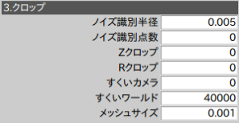
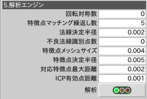
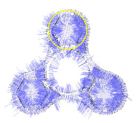
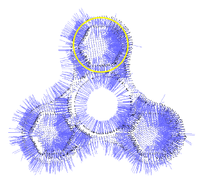
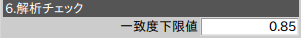

# 物体認識(Open3D)  
2D画像特徴量と同様、3D点群においても夫々の点の特徴量が定義できます。一般的な物体認識の処理は、特徴量を元に以下の手順にて行います。
1. マスターおよびシーン点群から法線を算出
2. マスターおよびシーン点群から(法線)特徴量を算出
3. 点群同士を特徴量マッチング(座標変換を推定)
4. 点群同士をICP法によりマッチング(座標変換を推定)

## **クロップ**パラメータ

### メッシュサイズ  
メッシュサイズは空間のサンプリングレートです。物体表面の凹凸が採取されるように調整します。しかしながら、全ての細かい特徴をサンプリングすることは好ましくありません。物体の識別が可能な箇所の凹凸に合わせることが重要です。
#### メッシュサイズの違い
<table>
<tr><td>1mmメッシュ<td>2mmメッシュ
<tr><td><td>
</table>

## **解析**パラメータ

### 法線決定半径  
点群の各点の法線は、その点の近傍点で定義される微小平面の法線にて定めます。近傍点を範囲を決めるのが、法線決定半径です。半径は、小さい程細かい特徴（法線の向きの変化）を表せますが、ノイズに弱くなり、大きいと安定しますが、細かい特徴は埋もれます。
#### 法線決定半径の違い
<table>
<tr><td>半径2mm<td>半径4mm
<tr><td><td>
</table>
メッシュサイズはどちらも1mm

### 特徴点決定半径  
点の特徴量はその点の法線と、点近傍の法線のなす角の度数分布（33分割）みたいんもんです。特徴点決定半径は近傍法線の範囲を決めます。特徴量として有効であるには、その近傍法線に分布の特徴が必要です。最善は３方向に一定度数の分布があるような法線がその範囲に含まれるような範囲です。
そうでなくても、２方向以上の法線がその範囲内に含まれるよう半径を決定するのがよい。

#### 課題  
1. 特徴量を可視化する手段は今のところないです。この33次元のベクタが可視化できると、設定がわかりやすい・・・

### 特徴点メッシュサイズ  
特徴点算出〜マッチングは重たい処理のため、元のメッシュサイズより粗いメッシュから特徴点を算出することで処理の高速化をした方がよい。元のメッシュサイズの2倍程度（処理量およそ1/4）を目安とします。

### 対応特徴点最大距離  
後述のICPと同様、特徴点同士のマッチングでも一致度（Fitness）が評価されます。この距離内にある点同士はマッチングしたと判定されます。

### ICP有効点距離  
特徴点同士のマッチングで近い位置まで寄せられた点群同士は、最終的にはICP法にて精密にマッチングします。この距離内にある点同士はマッチングしたと判定されます。VTで表示される一致度は以下の式です
~~~
Fitness=(マスター点群のうちマッチングした点数)/(マスター点群すべての点数)
~~~
### その他の設定
#### 回転対象数  
軸対称な対象物のとき、出来るだけアームが回転しないような姿勢を得るため、対象の回対称数を設定します。使用しないときは０を設定します。
#### 特徴点マッチング繰り返し数  
特徴点マッチング繰り返し数は、同じ特徴量を元に、ソルバーのみ繰り返し計算を行います。特徴点マッチングが誤った位置にマッチングしてしまう場合は、繰り返し数を増やして、複数の候補を算出し、この中から選別するようにできます。選別基準は後述の解析チェックにて設定します。

## **解析チェック**パラメータ

### 一致度下限値  
候補の中から、一致度がこの閾値より高いものを選別します。

### アジムス  
候補の中から、対象物の傾きがこの閾値より小さいものを選別します。

### 複数候補から選別  
解析チェックにて絞りこまれた候補が複数存在する場合は、以下の基準にて選別します。
1. 最もカメラ近いもの  
ピッキングなどで効果的な選別方法

## ソルバー
ソルバー(src/rovi_utils/ransac_solver.pyなど)のインタフェースは以下に標準化することで、*import*文の切り替えで、異なるアルゴリズムが選択できます。

### インタフェース  

|メソッド|Arg1|Arg2|Return|Description|
|:----|:----|:----|:----|:----|
|learn|マスター点群データ（ndarray）のリスト|パラメータ辞書|法線つきPointCloud|与えられたマスター点群(ndarray)から、法線つきPointCloudと特徴点配列を生成し、学習済データとする。|
|solve|シーン点群データ（ndarray）のリスト|パラメータ辞書|結果辞書（以下詳細）|与えられたシーン点群と学習済データをマッチングする|

#### 結果
|キー|Type|Description|
|:----|:----|:----|
|transform|ndarray[4x4]|点群同士がマッチングする変換行列|
|fitness|float|一致度|
